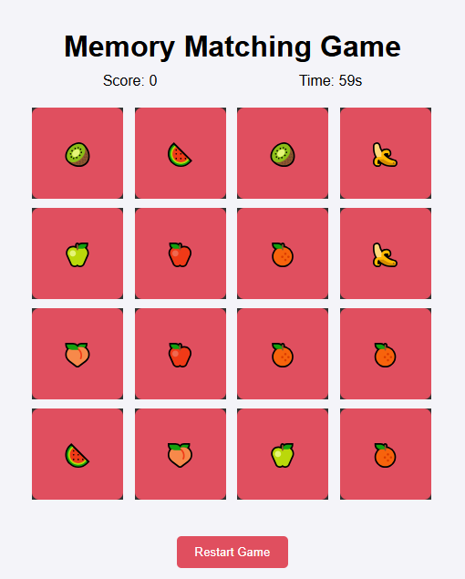

### README.md

# Memory Matching Game

A fun and interactive memory matching game where players flip cards to find matching pairs. The game gets progressively harder with increasing levels, features a scoring system, and challenges players to beat the timer.

## Features

- **Dynamic Levels:** Difficulty increases as you progress.
- **Scoring System:** Earn points for every matching pair.
- **Timer:** Beat the clock to complete each level.
- **Responsive Design:** Works on various screen sizes.
- **Restart Option:** Reset and start over anytime.

## How to Play

1. Flip two cards to reveal their symbols.
2. If the cards match, they remain flipped, and you earn points.
3. If the cards don’t match, they flip back over.
4. Match all pairs within the time limit to complete the level.
5. Progress to higher levels with more cards and less time.

## Installation

1. Clone the repository:
   ```bash
   git https://github.com/Abdulrauf1122/Memory_Matching_Game.git
   ```
2. Navigate to the project folder:
   ```bash
   cd memory-matching-game
   ```
3. Open `index.html` in your preferred browser.

## Technologies Used

- HTML5
- CSS3
- JavaScript (ES6)

## File Structure

```
memory-matching-game/
│
├── index.html        # Main HTML file
├── style.css         # Styling for the game
├── script.js         # Game logic and functionality
└── README.md         # Project documentation
```

## Gameplay Preview



## Contributing

Contributions are welcome! Please fork the repository and submit a pull request with your enhancements or bug fixes.

## License

This project is licensed under the MIT License. See the [LICENSE](LICENSE) file for details.
```
